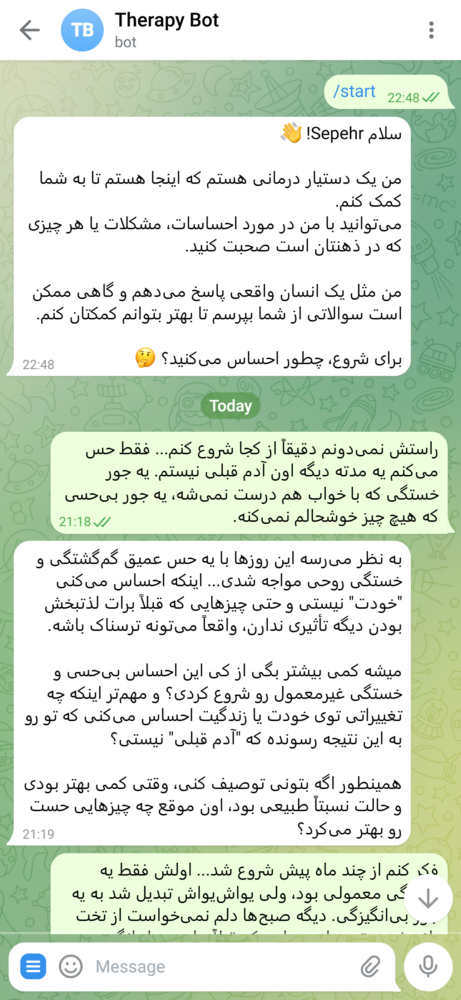
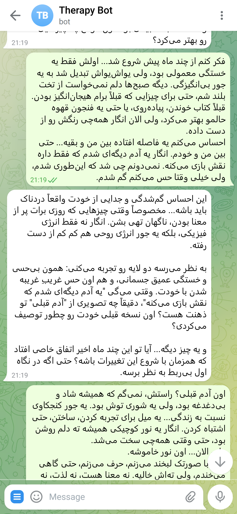
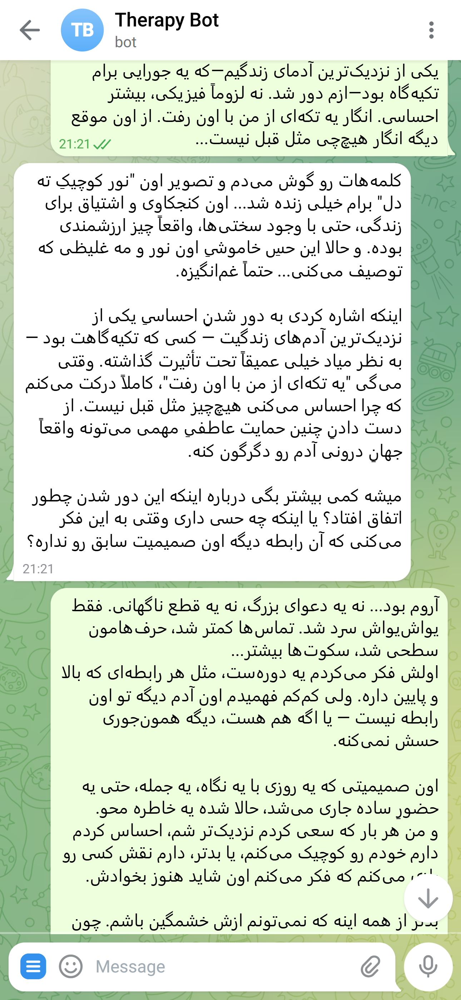

# Telegram Therapy Bot 🤖💬

A sophisticated AI-powered therapy bot for Telegram that provides personalized therapeutic conversations using advanced personality analysis and memory management.

## 📱 Screenshots
<div align="center">
  
  
  
</div>
Example conversations showing the bot's therapeutic responses and personality analysis</div>

## ✨ Features

- **Intelligent Conversation Flow**: Human-like responses with strategic questioning
- **Dynamic Personality Analysis**: AI-powered user trait analysis and adaptation
- **Memory Management**: Short-term and long-term conversation memory
- **LangGraph Workflow**: Advanced conversation processing with dual-node architecture
- **MongoDB Integration**: Scalable data storage for users, conversations, and memories
- **OpenRouter AI**: Powered by DeepSeek R1 model for therapeutic responses
- **Comprehensive Logging**: Full activity tracking and error monitoring

## 🏗️ Architecture

### Graph Workflow
```
User Message → Node 1 (User Analysis) → Node 2 (Response Generation) → Bot Response
```

**Node 1 - User Analysis:**
- Retrieve personality traits
- Analyze emotional state
- Access relevant memories
- Determine response strategy

**Node 2 - Response Generation:**
- Generate human-like responses
- Include follow-up questions
- Update personality analysis
- Save important memories

### Response Patterns
- 30% Immediate responses (direct answers)
- 40% Clarifying questions ("Tell me more about...")  
- 30% Reflective responses ("It sounds like you're feeling...")

## 📁 Project Structure

```
telegram_therapy_bot/
├── main.py                           # Main bot application
├── config.py                         # Configuration settings
├── database/
│   ├── __init__.py
│   ├── mongodb.py                    # MongoDB operations
│   └── models.py                     # Data schemas
├── ai_services/
│   ├── __init__.py
│   ├── openrouter_client.py          # AI client
│   ├── personality_analyzer.py       # Personality analysis
│   └── memory_manager.py             # Memory management
├── graph/
│   ├── __init__.py
│   ├── therapy_graph.py              # LangGraph workflow
│   ├── nodes/
│   │   ├── __init__.py
│   │   ├── user_analysis_node.py     # User analysis node
│   │   └── response_generation_node.py # Response generation node
│   └── state.py                      # Graph state management
├── utils/
│   ├── __init__.py
│   └── logger.py                     # Logging utility
├── requirements.txt
└──  .env
```

## 🛠️ Installation

### Prerequisites
- Python 3.8+
- MongoDB (local or cloud)
- Telegram Bot Token
- OpenRouter API Key

### Setup

1. **Clone the repository**
```bash
git clone https://github.com/SepehrNorouzi7/telegram-therapy-bot.git
cd telegram-therapy-bot
```

2. **Install dependencies**
```bash
pip install -r requirements.txt
```

3. **Create environment file**
```bash
cp .env.example .env
```

4. **Configure environment variables**
```env
TELEGRAM_BOT_TOKEN=your_bot_token_here
OPENROUTER_API_KEY=your_openrouter_key_here
MONGO_URI=mongodb://localhost:27017/
DATABASE_NAME=therapy_bot
LOG_LEVEL=INFO
```

5. **Run the bot**
```bash
python main.py
```

## 📋 Dependencies

```txt
python-telegram-bot==20.7
openai
langgraph
pymongo
python-dotenv
pydantic
asyncio
```

## 🗄️ Database Schema

### Users Collection
```json
{
  "_id": "user_telegram_id",
  "first_name": "string",
  "username": "string",
  "personality_traits": {
    "openness": 0.7,
    "conscientiousness": 0.6,
    "extraversion": 0.4,
    "agreeableness": 0.8,
    "neuroticism": 0.3,
    "communication_style": "direct/supportive/analytical",
    "emotional_state": "stable/anxious/depressed",
    "preferred_therapy_approach": "CBT/humanistic/behavioral"
  },
  "created_at": "datetime",
  "updated_at": "datetime",
  "session_count": 0
}
```

### Conversations Collection
```json
{
  "_id": "conversation_id",
  "user_id": "user_telegram_id",
  "messages": [
    {
      "role": "user/assistant",
      "content": "message text",
      "timestamp": "datetime",
      "emotion_detected": "happy/sad/angry/anxious",
      "context_importance": "high/medium/low"
    }
  ],
  "session_summary": "AI generated summary",
  "created_at": "datetime"
}
```

### Memory Collection
```json
{
  "_id": "memory_id",
  "user_id": "user_telegram_id",
  "memory_type": "short_term/long_term",
  "content": "important information",
  "importance_score": 0.8,
  "created_at": "datetime",
  "last_accessed": "datetime",
  "access_count": 5
}
```

## 🤖 Bot Commands

- `/start` - Initialize conversation and welcome message
- `/help` - Display usage instructions and available features

## 🧠 AI Features

### Personality Analysis
- **Big Five Traits**: Openness, Conscientiousness, Extraversion, Agreeableness, Neuroticism
- **Communication Style**: Direct, Supportive, Analytical
- **Emotional State**: Real-time emotion detection
- **Therapy Approach**: CBT, Humanistic, Behavioral adaptation

### Memory System
- **Short-term**: Last 10-15 messages, current session context
- **Long-term**: Important life events, recurring themes, progress milestones
- **Dynamic Importance**: AI-scored memory relevance and access patterns

## 📊 Logging

Comprehensive logging system tracks:
- User interactions and message flows
- AI processing and decision points
- Database operations and errors
- System performance metrics
- Therapeutic session analytics

## ⚠️ Important Notes

### Privacy & Ethics
- All conversations are confidential and securely stored
- Users should be informed this is an AI assistant, not a replacement for professional therapy
- Critical mental health situations should be directed to professional services
- Data retention policies should comply with local regulations

### Limitations
- This bot provides supportive conversation, not professional therapy
- Emergency situations require immediate professional intervention
- AI responses may not always be appropriate for complex mental health issues

## 🚀 Getting Started

1. Create a Telegram bot via [@BotFather](https://t.me/botfather)
2. Get your OpenRouter API key from [OpenRouter.ai](https://openrouter.ai)
3. Set up MongoDB database (local or cloud)
4. Configure environment variables
5. Deploy and start conversations!
